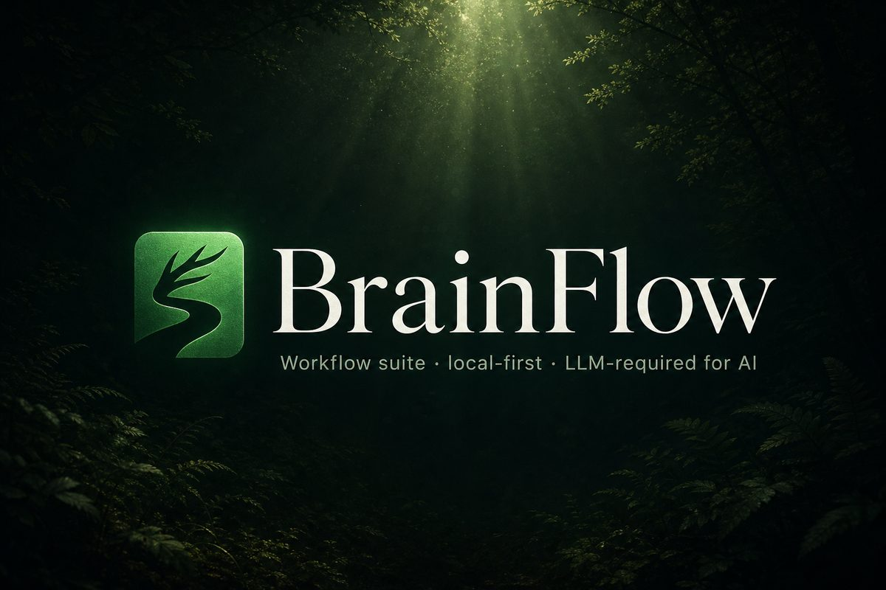
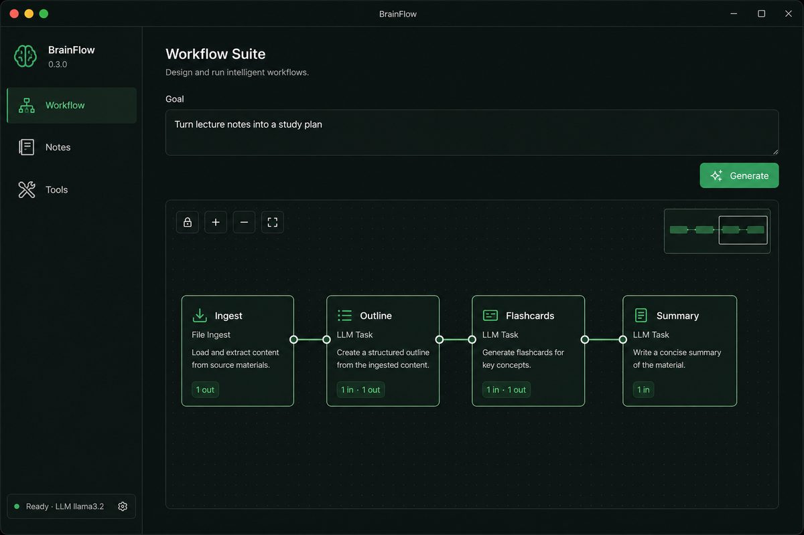
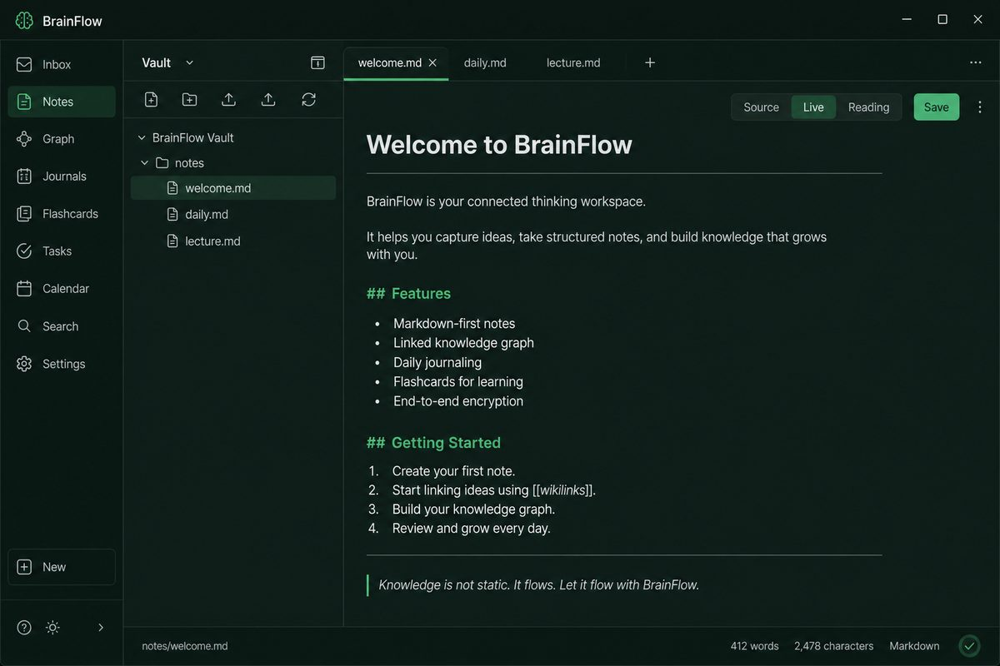
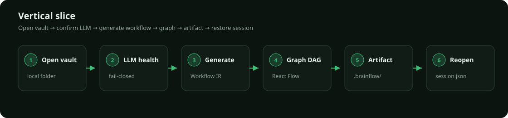
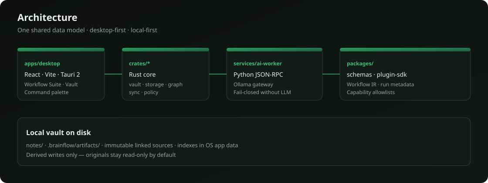
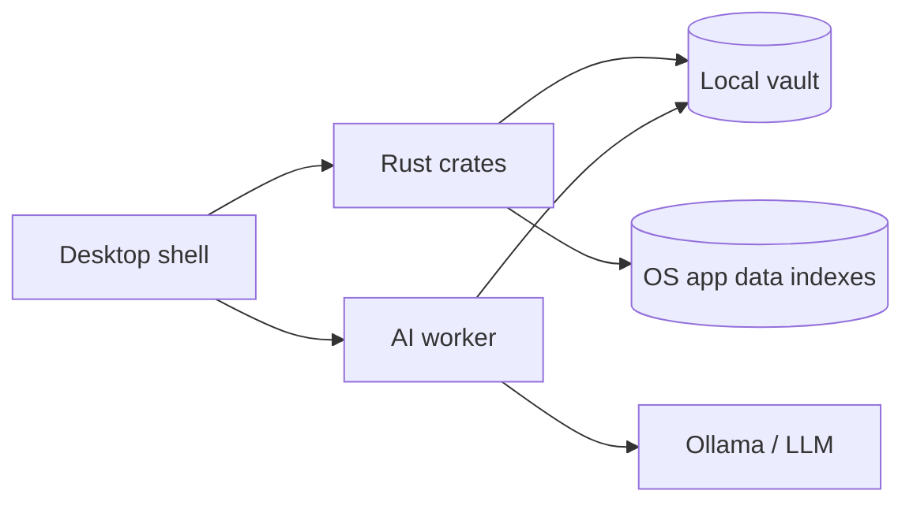

<p align="center">
  
</p>

<h1 align="center">BrainFlow</h1>

<p align="center">
  <strong>Desktop-first · local-first · workflow-operating environment</strong><br />
  Obsidian-class vaults + mandatory LLM workflow generation + provenance you can trust.
</p>

<p align="center">
  <a href="https://github.com/ericcayers-ai/BrainFlow/releases/tag/v0.1.2"></a>
  
  
  
</p>

<p align="center">
  
</p>

BrainFlow is not primarily a file browser. The default landing experience is the **AI Workflow Suite**: goal → editable DAG → execution state → artifacts → evidence.

Sources stay **immutable by default**. BrainFlow writes versioned derived work under `.brainflow/` — never silent rewrites of linked originals.

> **Honest status:** unsigned Windows alpha (`v0.1.2`). CI green on the vertical slice. Installers are **not** code-signed; macOS/Linux packaging is unverified. See [docs/REMAINING_GAPS.md](docs/REMAINING_GAPS.md).  
> Releases: [v0.1.2](https://github.com/ericcayers-ai/BrainFlow/releases/tag/v0.1.2)

---

## See the shell

v0.1.2 ships a workflow-first activity rail: **Workflow** · **Notes** · **Tools** (Studio).

<table>
  <tr>
    <td width="50%">
      
      <p align="center"><sub><b>Workflow</b> — goal prompt, generate, graph</sub></p>
    </td>
    <td width="50%">
      
      <p align="center"><sub><b>Notes</b> — vault rail + markdown editor</sub></p>
    </td>
  </tr>
</table>

| Focus | Job | Shortcut |
|-------|-----|----------|
| **Workflow** | Goal → LLM workflow → graph → artifacts | `Ctrl+1` |
| **Notes** | Vault files, editor, Bases, Canvas | `Ctrl+2` |
| **Tools** | Models, sync, display prefs (Studio) | `Ctrl+3` |

Command palette: `Ctrl+K`. Guided mode hides Tools until you switch to Studio.

---

## Product contract (at a glance)

| Principle | Behavior |
|-----------|----------|
| Workflow-first | Default landing is the Workflow Suite, not a file browser |
| Immutable sources | Linked imports are read-only; writes go to versioned derived artifacts |
| LLM-required for AI | No validated LLM → AI workflow creation pauses — no pretend AI |
| Honest “any file” | Only files with a safe adapter; fail closed on DRM/corrupt/unknown |
| Best local model | Highest-scoring validated fit for task + measured hardware |
| Reproducibility | Pin model digest, prompt-pack, input hashes, schema, settings per run |

Full contract: [docs/PRODUCT_SPEC.md](docs/PRODUCT_SPEC.md) · Non-goals: [docs/NON_GOALS.md](docs/NON_GOALS.md) · Agency: [docs/AI_SAFETY_AND_AGENCY.md](docs/AI_SAFETY_AND_AGENCY.md)

---

## How a run looks

<p align="center">
  
</p>

### Example goal

```text
Turn my lecture notes into a 5-day study plan with flashcards
and a one-page summary I can review before the exam.
```

### Example Workflow IR (trimmed)

```json
{
  "schema_version": 1,
  "id": "wf_study_plan",
  "title": "Lecture → study plan",
  "nodes": [
    { "id": "ingest", "type": "read_notes", "label": "Ingest lecture notes" },
    { "id": "outline", "type": "llm_transform", "label": "Build outline" },
    { "id": "cards", "type": "llm_transform", "label": "Draft flashcards" },
    { "id": "summary", "type": "write_artifact", "label": "Write summary.md" }
  ],
  "edges": [
    { "from": "ingest", "to": "outline" },
    { "from": "outline", "to": "cards" },
    { "from": "outline", "to": "summary" }
  ]
}
```

Artifacts land under `.brainflow/artifacts/<workflow>/<run>/` with run metadata pinned for replay.

---

## Architecture

<p align="center">
  
</p>

```
apps/desktop          React + TypeScript + Vite + Tauri 2 shell
crates/*              Rust core: vault, storage, graph, sync, policy, app-core
services/ai-worker    Supervised Python worker (JSON-RPC stdio, Ollama gateway)
packages/schemas      Versioned JSON Schemas (Workflow IR + run metadata)
packages/plugin-sdk   Capability-based plugin manifest stub
docs/                 Product, architecture, spikes, security, QA
```

Spike outcomes: [docs/spikes/SPIKE_RESULTS.md](docs/spikes/SPIKE_RESULTS.md)



---

## Quick start

### Prerequisites

- Node.js 20+
- Rust stable (MSVC on Windows) + [Tauri 2 prerequisites](https://v2.tauri.app/start/prerequisites/)
- Python 3.11+
- [Ollama](https://ollama.com) with at least one model (`ollama pull llama3.2:3b`)

### Install

```bash
# JS workspaces
npm install

# Python worker
cd services/ai-worker
python -m venv .venv
# Windows: .\.venv\Scripts\activate
source .venv/bin/activate   # macOS / Linux
pip install -e ".[dev]"
cd ../..
```

The Tauri shell prefers `services/ai-worker/.venv/.../python` automatically (or set `BRAINFLOW_PYTHON`).

### Run

```bash
# Desktop (recommended)
npm run dev:desktop

# Frontend-only Vite (no vault/LLM IPC)
cd apps/desktop && npm run dev

# Unsigned release-style build
npm run build:desktop
```

### Optional checks

```bash
cargo test -p brainflow-vault -p brainflow-storage
npm run test:e2e:vertical-slice
npm run measure:cold-start   # Windows release binary cold-start
```

### Slice checklist in the UI

1. **Open vault** — local folder (avoid OneDrive). Creates `.brainflow/` + `notes/`.
2. **Edit / save** `notes/welcome.md` — atomic write.
3. Confirm **LLM health** — fail-closed if Ollama is down.
4. **Generate workflow** — schema-validated Workflow IR.
5. **Graph** — React Flow + ELK renders the DAG.
6. **Artifact** — Markdown under `.brainflow/artifacts/.../summary.md`.
7. **Reopen** — session restores from `%LOCALAPPDATA%\BrainFlow\session.json`.

Indexes live under `%LOCALAPPDATA%\BrainFlow\indexes\` (not inside the vault).

---

## Cloud sync warning

Vaults under OneDrive / Dropbox / iCloud can race with Git and watchers. Prefer a **local disk** path. Machine indexes stay in OS app data — [docs/DATA_MODEL.md](docs/DATA_MODEL.md).

---

## Documentation map

| Start here | Then |
|------------|------|
| [PRODUCT_SPEC.md](docs/PRODUCT_SPEC.md) | [UX_PRINCIPLES.md](docs/UX_PRINCIPLES.md) |
| [ARCHITECTURE.md](docs/ARCHITECTURE.md) | [WORKFLOW_IR.md](docs/WORKFLOW_IR.md) |
| [REMAINING_GAPS.md](docs/REMAINING_GAPS.md) | [ROADMAP.md](ROADMAP.md) |
| [OBSIDIAN_PARITY.md](docs/OBSIDIAN_PARITY.md) | [PLUGIN_SDK.md](docs/PLUGIN_SDK.md) |
| [RELEASE.md](docs/RELEASE.md) · [VERSIONING.md](docs/VERSIONING.md) | [BETA_CHECKLIST.md](docs/BETA_CHECKLIST.md) |
| [adr/](docs/adr/) | [CONTRIBUTING.md](CONTRIBUTING.md) · [CODE_OF_CONDUCT.md](CODE_OF_CONDUCT.md) |

---

## Contributing

See [CONTRIBUTING.md](CONTRIBUTING.md). Bug / feature templates live under `.github/ISSUE_TEMPLATE/`.

## License

Licensed under the [Apache License 2.0](LICENSE). Copyright 2026 BrainFlow contributors.
