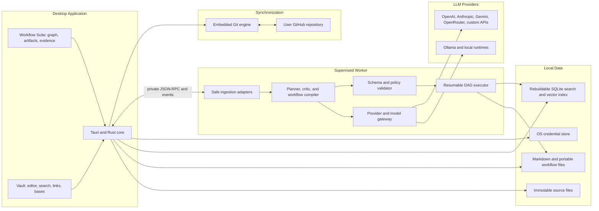

# Architecture

Normative system design for BrainFlow desktop. Decisions refined by ADRs under [adr/](adr/).

**Stack:** Tauri 2 shell · React/TypeScript UI · least-privilege Rust core · supervised Python ingestion/AI worker.

Platform order: Windows-first alphas; continuous macOS/Linux; mobile/web deferred until portable contracts stabilize.

---

## 1. Context diagram

---

## 2. Process topology

| Process | Trust | Responsibility |
|---------|-------|----------------|
| UI (WebView) | Least privilege; CSP | Rendering, a11y, user intent |
| Rust core (Tauri) | High — OS FS/Git/keychain | Commands, permissions, job supervision, sync, vault I/O |
| Python worker | Supervised child | Ingestion, embeddings orchestration, LLM gateway, planner/executor nodes |
| External LLM runtimes | Untrusted network/local daemon | Inference only via gateway |
| Git remote | Untrusted network | Sync payloads |

Worker must **not** be an unauthenticated localhost HTTP server on a fixed port. Prefer private inherited pipe / platform IPC ([adr/0002-sidecar-transport.md](adr/0002-sidecar-transport.md)). Every message validated against [packages/schemas](../packages/schemas) (planned).

---

## 3. Monorepo boundaries

| Path | Language | Owns |
|------|----------|------|
| `apps/desktop` | TS/React/Vite/Tauri | Shell, editor, graphs, settings, onboarding, a11y |
| `crates/app-core` | Rust | Commands, events, job supervision, app state |
| `crates/vault` | Rust | Safe FS, watchers, atomic writes, snapshots, links, file identity |
| `crates/storage` | Rust | SQLite migrations, FTS5, vector metadata, rebuild |
| `crates/graph` | Rust | Typed property graph, projections, queries, layout contracts |
| `crates/sync` | Rust | Git state machine, GitHub auth, merge/conflict, recovery |
| `crates/policy` | Rust | Deterministic authorization, budgets, schema checks, approval classes |
| `services/ai-worker` | Python | Adapters, retrieval, planning, critique, execution nodes |
| `packages/schemas` | JSON Schema | Shared contracts; generate TS/Rust/Python bindings |
| `packages/plugin-sdk` | TS/WASM | Capability manifests, declarative UI contributions |
| `tests/corpus` | Fixtures | Golden + adversarial files |
| `tests/evals` | Eval harness | Quality, provenance, injection, model selection |

**Rule:** Provider-specific AI calls live only in the gateway; sync is never an AI tool; policy decisions are deterministic in Rust.

---

## 4. Preferred components

| Concern | Choice | Notes |
|---------|--------|-------|
| Desktop shell | Tauri 2 | Capabilities, CSP, signed updates ([adr/0001](adr/0001-tauri-vs-electron.md)) |
| Markdown editor | CodeMirror 6 | Source + live preview; CommonMark/GFM + wikilinks, embeds, callouts, math, frontmatter |
| Portable truth | Markdown + versioned workflow JSON | User-owned |
| Local catalog | SQLite + FTS5 + per-embedding-profile vectors | Rebuildable ([adr/0004](adr/0004-storage.md)) |
| Workflow / mind / tree UI | React Flow + ELK in Web Worker | Editable DAGs |
| Dense knowledge UI | Cytoscape.js | Exploration scale ([adr/0003](adr/0003-graph-engines.md)) |
| Worker IPC | Private pipe / platform IPC | Schema-validated JSON-RPC + events |
| Secrets | OS keychain | Never in vault.json |
| Sync | Embedded Git | State machine ([adr/0005](adr/0005-git-strategy.md)) |
| Dependencies | Latest stable at impl time | Pinned lockfiles; controlled update PRs |

---

## 5. Privilege model

- Tauri capabilities **per window**; filesystem grants scoped to vault roots and explicit linked sources.  
- Strict CSP; no remote script execution in vault content.  
- Worker runs with restricted env; quarantine active content during ingestion.  
- Planning models cannot open FS/Git/shell tools.  
- Sync credentials never passed to the worker as ambient env; injected per job if required (prefer core-handled Git).

---

## 6. Data flow — import to artifact

1. User links/copies source → Rust vault records identity (UUID, hash, path history).  
2. Worker intake → `DocumentBundle` (untrusted).  
3. Index/embed after privacy checks (local SQLite).  
4. Planner/compiler (LLM) → workflow IR JSON.  
5. Rust policy + schema validation → accept/reject.  
6. Executor (worker + core) → safe overlay writes + run events.  
7. Graph projections update from canonical model.  
8. Optional Git sync via core state machine.

---

## 7. Failure and recovery

- Atomic writes + WAL for SQLite; vault snapshots for recovery.  
- Worker crash: core marks job failed/interrupted; resume from last durable run event.  
- Sync interruption: no force-push; queue + recovery docs in [GITHUB_SYNC.md](GITHUB_SYNC.md).  
- Model failure: pause AI path; vault edit/search/sync remain.

---

## 8. OneDrive / concurrent sync

If vault path is under a known cloud sync root, UI must warn at open time. Recommend relocating. Exclude local indexes via `.gitignore` and OS sync-exclusion guidance. Conflict copies (`*_Conflict*`, `conflicted copy`) must not be auto-merged into IR.

---

## 9. Extensibility

Plugins: signed manifests, declarative commands/nodes/importers/exporters/panels/schemas/themes, sandboxed WASM. No arbitrary DOM/native in v1.

---

## 10. Implementation order

Do not scaffold full monorepo until Phase 1 spikes confirm packaging/IPC. Phase 0 produces this document and ADRs; Phase 2 materializes crates/apps.
