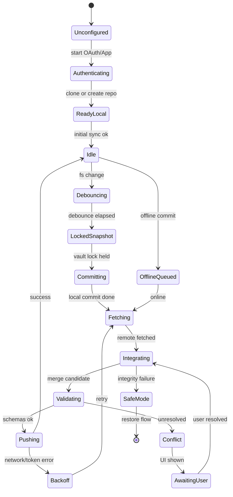

# GitHub Sync

Git is a **dedicated sync state machine** — never a sequence of hidden shell commands and **never** an AI tool.

Related: [DATA_MODEL.md](DATA_MODEL.md) · [SECURITY.md](SECURITY.md) · [PRIVACY.md](PRIVACY.md)

---

## 1. Goals

- Automatic, **non-destructive** multi-device sync via user GitHub repositories  
- Offline editing with visible queue  
- Semantic/structural conflict visibility  
- No automatic force-push  
- Honest privacy: private ≠ E2E encrypted  

---

## 2. State machine (per vault)

Transitions must be durable (persist sync status) so crashes resume safely.

---

## 3. Step detail

1. **Authenticate** — GitHub OAuth / GitHub App; token in OS credential store; **minimal** repo scope. Support clone existing or create new **private** repo.  
2. **Initialize** — BrainFlow `.gitignore` excludes indexes, embeddings, secrets, caches, machine settings, transient run logs, extraction temps.  
3. **Commit path** — debounce FS events; acquire vault sync lock; wait for atomic writes; snapshot pending changes; device-attributed commit with human-readable summary.  
4. **Integrate** — fetch; non-destructive three-way merge; validate vault/workflow schemas; push only if validation succeeds; **never** auto force-push.  
5. **Merge strategies**  
   - Markdown: block/paragraph-aware three-way when possible  
   - Workflow/graph JSON: structural merge by stable IDs  
   - Renames: detect  
   - Binaries unresolved: keep both sides  
6. **Conflicts** — stop background push; show files/nodes + base/local/remote; keep recovery copies; resume after resolution.  
7. **Offline** — commits queue visibly; exponential backoff; sync triggers: interval / save / close / resume (settings). Status/history panel required.  
8. **Health** — object integrity; interrupted-op recovery; clone-to-new-location restore; read-only **safe mode** after serious corruption.  
9. **Pre-commit scans** — likely credentials; oversized/generated files. Git LFS **opt-in** with quota warnings.  
10. **Privacy copy** — private repo is ACL, not E2E. Encrypted vault mode deferred until merge/recovery proven.

---

## 4. Failure matrix (must test)

| Scenario | Expected |
|----------|----------|
| Simultaneous edits 2–3 devices | Conflict UI or clean merge; no silent clobber |
| Rename vs delete race | Explicit resolution; recovery copies |
| Clock skew | Still correct by Git semantics; UI not confused |
| Network interruption mid-push | Retry; no half-applied remote without local record |
| Token expiry / SSO | Actionable reauth; queue preserved |
| Detached / changed default branch | Detect; guide repair; no force |
| Non-fast-forward | Fetch/integrate; never force |
| LFS failure | Clear error; no pretending sync ok |
| OneDrive conflict copies present | Do not auto-commit junk; warn |

---

## 5. Security rules

- Credentials never logged.  
- Sync not exposed to planner tools.  
- Signed-off commits optional; trailers may include device id **hash**, not secrets.  
- Secret scanning blocks commit with remediation UI.

---

## 6. Acceptance criteria

- AC-SYNC-01: Forced kill mid-push → remount → no data loss; status recovers.  
- AC-SYNC-02: Automated tests assert zero `force` push invocations in normal machine.  
- AC-SYNC-03: Conflict leaves both versions recoverable.  
- AC-SYNC-04: Invalid workflow JSON after merge fails validation and blocks push.  
- AC-SYNC-05: Offline queue drains after reconnect without duplicates for idempotent commits.

---

## 7. Auth how-to (credentials → OS store only)

BrainFlow **never** writes tokens into the vault. Use the **GitHub Sync** panel or Tauri commands below.

### Option A — Personal Access Token (simplest)

1. GitHub → **Settings → Developer settings → Personal access tokens**.
2. Create a classic token with **`repo`** scope, or a fine-grained token with Contents/Metadata on the target private repo.
3. In BrainFlow Sync panel: paste the token → **Store PAT in OS keychain**  
   (Windows Credential Manager / macOS Keychain / libsecret).
4. Either:
   - **Link existing** — paste `https://github.com/<you>/<repo>.git`, or  
   - **Create private on GitHub** — enter a repo name (API creates a **private** repo).

### Option B — OAuth device flow

1. Register a GitHub OAuth App (Device Flow enabled). Note the **Client ID**.
2. Set env `BRAINFLOW_GITHUB_CLIENT_ID=<client_id>` before launching BrainFlow.
3. Sync panel → **Device flow** → open the verification URL and enter the user code.
4. Token is polled and stored in the OS credential store.

### Option C — GitHub App (documented)

Install a GitHub App with minimal repository permissions; mint an installation token externally (or future in-app flow) and store it via the same PAT path (`sync_set_pat`). Prefer repository-only permissions; never org-admin.

### Clear credentials

Sync panel → **Clear token**, or command `sync_logout`.

---

## 8. Implementation map (`github-sync`)

| Area | Path |
|------|------|
| State machine | `crates/sync/src/state.rs` |
| Auth + GitHub API | `crates/sync/src/auth.rs`, `credentials.rs` |
| gitoxide discovery + git2 porcelain | `crates/sync/src/git.rs` |
| Markdown / JSON merge | `crates/sync/src/merge.rs` |
| Preflight / `.gitignore` | `crates/sync/src/preflight.rs`, `gitignore.rs` |
| Journal / interrupt recovery | `crates/sync/src/recovery.rs` |
| Offline queue + history | `crates/sync/src/queue.rs` |
| Tauri commands | `apps/desktop/src-tauri/src/sync_cmds.rs` |
| Status / conflict UI | `apps/desktop/src/components/SyncPanel.tsx` |
| Conflict fixtures | `tests/sync/fixtures/` |

**Git LFS:** optional only — see large-file preflight warnings. Enable LFS manually on the remote if needed; BrainFlow does not auto-install LFS filters.

**Not an AI tool:** `brainflow_sync::is_ai_tool() == false`. Planner/worker must not gain Git verbs.

---

## 9. Multi-device / failure matrix — test progress

Tracks [§4 failure matrix](#4-failure-matrix-must-test). Status values: **unit** (crate tests), **fixture** (`tests/sync/fixtures`), **manual** (human soak), **open**.

| Scenario | Status | Evidence |
|----------|--------|----------|
| Simultaneous edits 2–3 devices | fixture + unit | `workflow_conflict`, `markdown_conflict`, `three_device/` pairwise A×B / B×C; structural JSON by stable ids |
| Rename vs delete race | fixture + unit | `rename_delete/`; `delete_vs_edit` / `rename_or_delete` unresolved ids |
| Clock skew | fixture + unit | `clock_skew/` — content three-way; `authored_at` in meta is documentary only (Git OIDs win) |
| Network interruption mid-push | fixture + unit | `interrupt_mid_push/journal.json`; `recover_from_interrupt`; AC-SYNC-01 notes; never force-push unit |
| Token expiry / SSO | fixture + unit | `token_expiry/status.json` — unauthenticated + queue-preserved contract; live reauth soak not automated |
| Detached / changed default branch | fixture + unit | `default_branch_changed/status.json` — detect + never force; live repair UX open |
| Non-fast-forward | unit | Push path rejects force; integrate/fetch retry |
| LFS failure | open | Preflight warns large files; LFS opt-in only |
| OneDrive conflict copies | unit | Preflight `GeneratedJunk` for OneDrive-conflict filenames |
| Offline queue drain | fixture + unit | `offline_queue/`; idempotent enqueue + `drain_queue` (AC-SYNC-05) |

**Live multi-device soak** (two real machines + real GitHub private repo) remains a **beta gate**, not claimed complete by unit/fixture coverage.

### Dry-run simulation (automated)

`cargo test -p brainflow-sync --test multi_device_dry_run` chains fixture merges (3-device pairwise, clock skew), interrupt recovery, offline queue drain, and token-expiry / default-branch contracts **without** GitHub accounts or network. Evidence of no silent loss + never force-push under simulation.

### Manual live matrix (human-only — leave live soak unchecked)

| Step | Action | Pass condition |
|------|--------|----------------|
| 1 | Two devices, same private repo, Device A online edit + sync | Commit visible on remote |
| 2 | Device B offline edit same note, come online | Conflict UI or clean merge; no silent drop |
| 3 | Kill app mid-push on A | Journal recovers; no force-push; queue/retry honest |
| 4 | Expire / revoke token mid-session | Auth error; offline queue preserved |
| 5 | Change default branch on GitHub | Detect mismatch; never force |
| 6 | 3rd device simultaneous edit | Pairwise conflicts understandable; no data loss |

Record dates/hosts in a release soak log before checking Phase 8 live soak.
